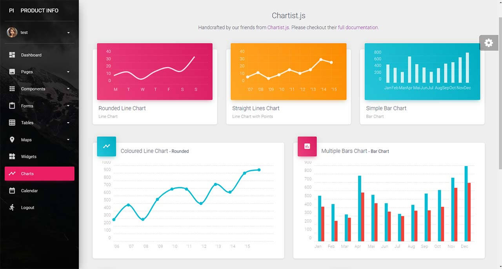
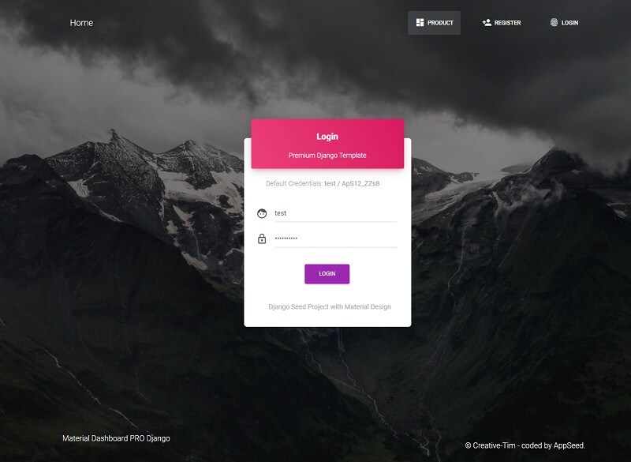

# Material Dashboard PRO Django

[**Django Template**](https://www.creative-tim.com/templates/django) crafted on top of **Material Dashboard PRO**, a premium Bootstrap 4 design. Start your development with a modern, dark-themed Bootstrap 4 Admin template for **Django**. It features a huge number of components built to fit together and look fantastic. If you want to code faster, with a smooth workflow, then you should try this template carefully developed with Django, a well-known Python Framework. **Django codebase** is crafted using a simple, modular structure that follows the best practices and provides authentication, database configuration, and deployment scripts for Docker and Gunicorn/Nginx stack.

> Links

* [Material Dashboard PRO Django](https://www.creative-tim.com/product/material-dashboard-pro-django) - product page
* [Material Dashboard PRO Django](https://www.creative-tim.com/live/material-dashboard-pro-django) - LIVE demo




### What is [Django](https://www.djangoproject.com/) <a id="what-is-django"></a>

[Django](https://www.djangoproject.com/) is a high-level Python Web framework that encourages rapid development and clean, pragmatic design. Built by experienced developers, it takes care of much of the hassle of Web development, so you can focus on writing your app without needing to reinvent the wheel. It’s free and open source.

> **Django Resources**

* [Django](https://www.djangoproject.com/) - official website
* [Django](https://docs.djangoproject.com/en/3.0/) - official documentation  


### Environment <a id="environment"></a>

To use the stater, [Python3](https://www.python.org/) should be installed properly in the workstation. If you are not sure if Python is properly installed, please open a terminal and type `python --version`. The full list with dependencies and tools required to build the app:

* [Python3](https://www.python.org/) - the programming language used to code the app
* [GIT](https://git-scm.com/) - used to clone the source code from the Github repository
* Basic development tools \(g++ compiler, python development libraries ..etc\) used by Python to compile the app dependencies in your environment.


> Check [Python](https://www.python.org/) version \(using the terminal\)

```text
$ # Check Python version
$ python --version
Python 3.7.2 # <--- All good
```

> Check [GIT](https://git-scm.com/) command tool \(using the terminal\)

```text
$ # Check git
$ git --version
$ git version 2.10.1.windows.1 # <--- All good
```

For more information on how to set up your environment please access the [product page](https://www.creative-tim.com/product/material-dashboard-pro-django) and ask for support. 


### Build the app <a id="build-the-app"></a>

To built and start the app locally, follow the steps:

> **Get the source code -** by accessing the [product page](https://www.creative-tim.com/product/material-dashboard-pro-django) and purchase a license.

Access the product page and download the latest stable release or clone the sources using GIT command-line tool.

> **Change the current directory** to `source code` directory

**Step \#1** - Create a Virtual Environment to isolate the app dependencies:

```bash
$ # Unix based systems
$ virtualenv env
$ source env/bin/activate
```

For Windows-based systems, please type:

```bash
$ # Windows based systems
$ # virtualenv env
$ # .\env\Scripts\activate
```

**Step \#2** - Install dependencies

```text
$ pip3 install -r requirements.txt
```

**Step \#3** - Set up database and create tables

```text
$ python manage.py makemigrations
$ python manage.py migrate
```

**Step \#4** - Start the app in development mode

```bash
$ python manage.py runserver
```

At this point, we can visit the app in the browser **`http://127.0.0.1:8000/`**. By default, the app will redirect guest users to the login page. To access the private pages:

* Create a new user using the **registration page**
* Authenticate using the **login page**




### App Codebase \(simplified\) <a id="app-codebase-simplified"></a>

The codebase is built using a modular, intuitive structure, quite easy to maintain and extend by any developer with basic **Python/Django** knowledge: 

```text
< PROJECT ROOT >
   |
   |-- core/                       # Implements app logic and serve assets
   |    |-- static/
   |    |    |-- <css, JS, images> # CSS files, Javascripts files
   |    |-- templates/             # Templates used to render pages
   |         |-- includes/         # HTML chunks and components
   |         |-- layouts/          # Master pages
   |         |-- accounts/         # Authentication pages
   |         |
   |      index.html               # The default page
   |       *.html                  # All other HTML pages
   |
   |-- authentication/             # Handles auth routes (login and register)
   |-- app/                        # A simple app that serve HTML files
   |
   |-- requirements.txt            # Development modules - SQLite storage
   |
   |-- .env                        # Inject Configuration via Environment
   |-- manage.py                   # Start the app - Django default start script
   |
   |-- ****************************
```


### The bootstrap flow <a id="the-bootstrap-flow"></a>

* Django bootstrapper `manage.py` uses `core/settings.py` as the main configuration file
* `core/settings.py` loads the app magic from `.env` file
* Redirect the guest users to the `Login` page
* Unlock the pages served by the `app` node for authenticated users

### App Codebase <a id="app-codebase"></a>

The codebase structure is presented below:

```text
< PROJECT ROOT >
   |
   |-- core/                               # Implements app logic 
   |    |-- settings.py                    # Django app bootstrapper
   |    |-- wsgi.py                        # Start the app in production
   |    |-- urls.py                        # Define URLs served by all apps/nodes
   |    |
   |    |-- static/
   |    |    |-- <css, JS, images>         # CSS files, Javascripts files
   |    |
   |    |-- templates/                     # Templates used to render pages
   |         |
   |         |-- includes/                 # HTML chunks and components
   |         |    |-- navigation.html      # Top menu component
   |         |    |-- sidebar.html         # Sidebar component
   |         |    |-- footer.html          # App Footer
   |         |    |-- scripts.html         # Scripts common to all pages
   |         |
   |         |-- layouts/                  # Master pages
   |         |    |-- base-fullscreen.html # Used by Authentication pages
   |         |    |-- base.html            # Used by common pages
   |         |
   |         |-- accounts/                 # Authentication pages
   |         |    |-- login.html           # Login page
   |         |    |-- register.html        # Register page
   |         |
   |      index.html                       # The default page
   |     page-404.html                     # Error 404 page
   |     page-500.html                     # Error 404 page
   |       *.html                          # All other HTML pages
   |
   |-- authentication/                     # Handles authentication routes
   |    |
   |    |-- urls.py                        # Define authentication routes  
   |    |-- views.py                       # Handles login and registration  
   |    |-- forms.py                       # Define auth forms  
   |
   |-- app/                                # A simple app that serve HTML files
   |    |
   |    |-- views.py                       # Serve pages for authenticated users
   |    |-- urls.py                        # Define some super simple routes  
   |
   |-- requirements.txt                    # Development modules - SQLite storage
   |
   |-- .env                                # Inject Configuration via Environment
   |-- manage.py                           # Start the app 
   |
   |-- ************************************
```


### App Configuration <a id="app-configuration"></a>

The environment configuration file **`.env`** specify a short-list with variables:

* [`SECRET_KEY`](https://docs.djangoproject.com/en/3.0/ref/settings/#secret-key) - Used by Django for [cryptographic signing](https://docs.djangoproject.com/en/3.0/topics/signing/)
* `SERVER` - The public domain/address used in `production` 

```text
# File: core/settings.py

...

# SECRET_KEY value is read from `.env` file
SECRET_KEY = config('SECRET_KEY', default='S#perS3crEt_1122')

...

# Load the production server address from `.env` file
ALLOWED_HOSTS = ['localhost', '127.0.0.1', config('SERVER', default='127.0.0.1')]

...

# The SQLite database, located in the root of the project
DATABASES = {
    'default': {
        'ENGINE': 'django.db.backends.sqlite3',
        'NAME': os.path.join(BASE_DIR, 'db.sqlite3'),
    }
}

```

The default database is [SQLite](https://www.sqlite.org/) and the name and physical location can be changed by updating `core/settings.py` The database and associated tables are created during the migration commands, listed in the README file

```text
$ # README file, shipped with every Django project

...

$ python manage.py makemigrations
$ python manage.py migrate

...
```

> **Hint**: to visualize the SQLite database content an external tool should be installed: [DB Browser for SQLite](https://sqlitebrowser.org/) it might be a good choice.

### App Tables <a id="app-tables"></a>

The tables created by the Django migration are generated by the default modules that handle the authentication, session management, and permissions:

* [`django.contrib.auth`](https://docs.djangoproject.com/en/3.0/ref/contrib/auth/#django-contrib-auth) - Django middleware app that implements authentication
* `django.contrib.sessions` - Django middleware app that implements session management

### App Forms <a id="app-forms"></a>

The file **`authentication/forms.py`** defines the table\(s\) used by the application. Being a simple starter, by default the following forms are defined:

* Form \#1 - **LoginForm** with fields:
  * username
  * password


* Form \#2 - **SignUpForm** with fields:
  * name - The friendly name
  * email - eMail address
  * username - used to authenticate
  * password1 - used to authenticate
  * password2 - password check field


### App Routing <a id="app-routing"></a>

The settings file **`core/settings.py`** specify the routing file `core/urls.py` via `ROOT_URLCONF` variable

```text
# File: core/settings.py
...

ROOT_URLCONF = 'core.urls'

...
```

> **`core/urls.py`** file

The core routing file aggregates the routing from all apps defined in the project:

```text
# File: core/urls.py

urlpatterns = [
    # Django admin routes - inherited from Django default modules
    path('admin/', admin.site.urls),

    # Authentication routes - login / register
    # exposed by `authentication` app
    path("", include("authentication.urls")),

    # App routes - the modules that serve the UI Kit pages
    path("", include("app.urls"))
]

```

### Pages & Assets <a id="pages--assets"></a>

Pages served by the starter are organized using a simple folder structure:

```text
< PROJECT ROOT >
   |
   |-- core/                               # Implements app logic and serve the static assets
   |    |
   |    |-- static/assets/
   |    |    |-- css
   |    |    |-- JS
   |    |    |-- images
   |    |    |-- SCSS
   |    |
   |    |-- templates/                     # Templates used to render pages
   |         |
   |         |-- includes/                 # HTML chunks and components
   |         |    |-- navigation.html      # Top menu component
   |         |    |-- sidebar.html         # Sidebar component
   |         |    |-- footer.html          # App Footer
   |         |    |-- scripts.html         # Scripts common to all pages
   |         |
   |         |-- layouts/                  # Master pages
   |         |    |-- base-fullscreen.html # Used by Authentication pages
   |         |    |-- base.html            # Used by common pages
   |         |
   |         |-- accounts/                 # Authentication pages
   |         |    |-- login.html           # Login page
   |         |    |-- register.html        # Register page
   |         |
   |      index.html                       # The default page
   |     page-404.html                     # Error 404 page
   |     page-500.html                     # Error 404 page
   |       *.html                          # All other HTML pages
   |
   |-- app/                                # A simple app that serve HTML files
   |    |
   |    |-- views.py                       # Serve HTML pages for authenticated users
   |    |-- urls.py                        # Define some super simple routes  
   |
   |-- ************************************************************************
```

#### Static Assets <a id="static-assets"></a>

The folder that contains all assets provided by the UI Kit is located in the `core` directory

* `static/assets` - the root directory for all files \(JS, images\)
* `static/assets/css` - CSS files that style the app
* `static/assets/img` - Images and Icons
* `static/assets/js` - javascript files provided by the UI Kit
* `static/assets/scss` - SCSS files, if provided by the UI Kit vendor

#### `Templates` Folder <a id="templates-folder"></a>

All pages served by the application are located inside this folder.

* `templates/layouts` - the directory with app master pages
* `templates/includes` - the directory with HTML chunks and components
* `templates/accounts` - store the authentication pages \(login, registration\)
* `templates/` - all pages defined/served by the app are saved at the root of the `templates` folder

#### Common pages <a id="common-pages"></a>

This section lists the common pages defined in all Flask applications prototyped on top of this generic starter.

* login.html, rendered with `layouts/base-fullscreen.html`
* register.html, rendered with `layouts/base-fullscreen.html`
* index.html, rendered with `layouts/base.html`
* page-404.html, rendered with `layouts/base.html`
* page-403.html, rendered with `layouts/base.html`

### Data Structures <a id="data-structures"></a>

The starter exposes a short-list with data structures used globally across the app:

#### `request.user` object <a id="requestuser-object"></a>

Constructed by [AuthenticationMiddleware](https://docs.djangoproject.com/en/3.0/ref/middleware/#django.contrib.auth.middleware.AuthenticationMiddleware) can be used to detect if the current request is executed by an authenticated user or not. The object has global visibility and can be used in all app controllers and handlers but also in views.

> **Usage in controller**

```text
# Sample File

from django.http import HttpResponse

def testme(path):

    # Redirect guests users to login page
    if request.user.is_authenticated:
        return HttpResponse("User authenticated")
    else:
        return HttpResponse("Access forbidden - please authenticate")
```

> **Usage in view**

```text
    <div class="collapse navbar-collapse" id="navigation">
        <ul class="navbar-nav ml-auto">

        <!-- The Usage of <current_user> object -->
        

            <!-- Html chunk rendered for guests users-->

            <li class="nav-item ">
                <a href="{ % url 'register' % }" class="nav-link">
                    <i class="tim-icons icon-laptop"></i> Register
                </a>
            </li>
            <li class="nav-item ">
                <a href="{ % url 'login' % }" class="nav-link">
                    <i class="tim-icons icon-single-02"></i> Login
                </a>
            </li>

        

        </ul>
    </div>
```

###  <a id="django-resources"></a>

### [Django](https://www.djangoproject.com/) resources <a id="django-resources"></a>

* [Django](https://www.djangoproject.com/) - the official website
* [Django Documentation](https://docs.djangoproject.com/en/3.0/) - a `must-read` resource for any Django developer
* [Django Templates](https://www.creative-tim.com/templates/django) - more Django starters provided by Creative-Tim

